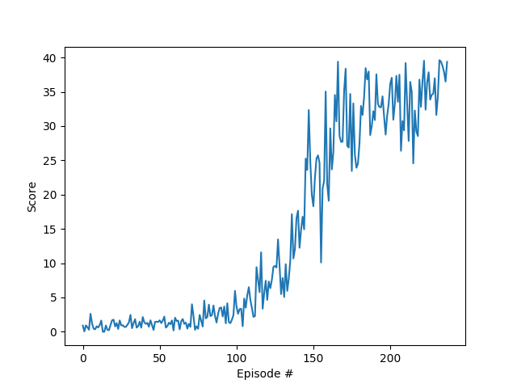

# Results report

## Selected hyperparameters

|Name|Value|
|---|---:|
|Episodes|2000|
|Actor learning rate|0.0005|
|Critic learning rate|0.0005|
|Gamma|0.85|
|Tau|0.001|
|Alpha|0.5|
|Beta|0.5|
|Buffer size|1000000|
|Batch size|1024|
|Target|30.0|
|Buffer|prioritized|

## [Deep Deterministic Policy Gradients](https://arxiv.org/abs/1509.02971)

### Actor network

- ReLU linear layer (in: number of states, out: 256)
- Tanh Linear layer (in: 256, out: number of actions)

### Critic network

- Leaky ReLU linear layer (in: number of states, out: 256)
- Leaky ReLU linear layer (in: number of actions + 256, out: 256)
- Leaky ReLU linear layer (in: 256, out: 128)
- Linear layer (in: 128, out: 1)

Rewards per episode:

